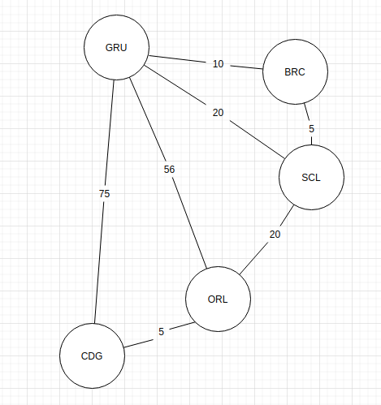

# Dijkstras Algorithm - Preço Melhor Rota #


## Índice ##
- [Visão Geral](#visão-geral)
- [Solução](#solução)
- [Sobre a Aplicação](#sobre-a-aplicao)
- [Instalação](#instalação)
- [Rodando a Aplicação](#rodando-a-aplicação)
- [Criando Novas Rotas](#criando-novas-rotas)
- [Busca Melhor Preço Rota](#busca-melhor-preço-rota)

## Visão Geral ##
Projeto criado com objetivo de encontrar o melhor preço da rota de uma viagem independente de quantas escalas serão realizadas.

#### Rota de Viagem ####

Um turista deseja viajar pelo mundo pagando o menor preço possível independentemente do número de conexões necessárias.
Vamos construir um programa que facilite ao nosso turista, escolher a melhor rota para sua viagem.

Para isso precisamos inserir as rotas através de um arquivo de entrada.

#### Input Example ####
```csv
GRU,BRC,10
BRC,SCL,5
GRU,CDG,75
GRU,SCL,20
GRU,ORL,56
ORL,CDG,5
SCL,ORL,20
```

#### Explicando ####
Caso desejemos viajar de **GRU** para **CDG** existem as seguintes rotas:

1. GRU - BRC - SCL - ORL - CDG ao custo de **$40**
2. GRU - ORL - CGD ao custo de **$64**
3. GRU - CDG ao custo de **$75**
4. GRU - SCL - ORL - CDG ao custo de **$48**
5. GRU - BRC - CDG ao custo de **$45**

### Solução ###
Para criar uma solução, usei a lógica do Algoritmo de Dijkstra, buscando assim a menor rota dentre os destinos, fazendo uma varredura da origem da viagem até o destino por todos os pontos possíveis, até encontrar o menor custo de todos.

#### Algoritmo de Dijkstra ####
> O algoritmo de Dijkstra, concebido pelo cientista da computação holandês Edsger Dijkstra em 1956 e publicado em 1959,[1][2] soluciona o problema do caminho mais curto num grafo dirigido ou não dirigido com arestas de peso não negativo, em tempo computacional O(m + n log n) onde m é o número de arestas e n é o número de vértices. O algoritmo que serve para resolver o mesmo problema em um grafo com pesos negativos é o algoritmo de Bellman-Ford, que possui maior tempo de execução que o Dijkstra. https://pt.wikipedia.org/wiki/Algoritmo_de_Dijkstra


O exemplo acima mostra como o algoritmo de Dijkstra decide qual a melhor rota com o menor custo, de um ponto ao outro. 

#### Nosso Grafo ####



O melhor preço é da rota **1** logo, o output da consulta deve ser **GRU - BRC - SCL - ORL - CDG**.

## Sobre a aplicação ##
Utilizei Java como linguagem de programação para a solução, pois é a linguagem que mais domino. 
- Ferramentas
    
    - Maven (gestor de dependências do projeto)
    - Spring boot (para exposição das rotas da API)

- Estrutura da aplicação


    - business - Regra do algoritmo de Dijkstra.
    - config - Configurações necessárias para o projeto.
    - controller - Responsável pela exposição dos enpoints da aplicação
    - exceptions - Caso algo esteja fora do padrão exigido da requisição, a aplicação informa que é necessário passar os parametros corramente pra executar a ação.
    - model - Models do projeto
    - util - Manipulação do arquivo .csv
    
## Instalação ##
- Instalar Java
  
  - Instalar SDKMan
  
    ```$ curl -s "https://get.sdkman.io" | bash```
    
    ```$ source "$HOME/.sdkman/bin/sdkman-init.sh"```
    
    - Verifique SDKMan version
    ```$ sdk version```
    
  - Instalando Java a partir do SDKMan
    
    Neste exemplo vamos usar a versão 13.0.2-open do Java
    
    - Instalando: ```$ sdk install java 13.0.2-open```
    
    - Utilizando a versão: ```$ sdk use java 13.0.2-open```
    
- Instalar Maven

    - <a href="https://maven.apache.org/install.html">Linux</a>
    - <a href="https://maven.apache.org/guides/getting-started/windows-prerequisites.html">Windows</a>
    - Checar instalação

        ``$ mvn --version``
    
    
    
- Instalando dependências do projeto

    ```$ mvn clean install```
    
    Durante a execução do código acima, é possível verificar que os testes já foram executados antes da construção do sistema.
    
    Mas caso queira rodar manualmente
    
    ```$ mvn test```

## Rodando a Aplicação ##

Para rodas a aplicação, devemos executar os seguintes comandos:
    
- Console

    ```mvn spring-boot:run -Dspring-boot.run.arguments=--runner=console```    
    
- API Rest

    ```mvn spring-boot:run```    
    
Nota: Em ambas as execuções, a interface de API Rest estará disponível para consulta.

## Criando Novas Rotas ##

```
curl --request POST \
  --url http://localhost:8080/newRoute \
  --header 'content-type: application/json' \
  --data '{
	"origin": "GRU",
	"destiny": "RAO",
	"cost": 30
    }'
```

E receberá o Response:

```
{
  "message": "New route GRU - RAO was created with sucess!",
  "payload": null
}
```

## Busca Melhor Preço Rota ##
- API
    ```
    curl --request POST \
      --url http://localhost:8080/bestRoute \
      --header 'content-type: application/json' \
      --data '{
    	"origin": "GRU",
    	"destiny": "CDG"
    }'
  ```

   E receberá o Response:
   
   ```
  {
    "message": "The best route was find with success!",
    "payload": {
      "path": "GRU BRC SCL ORL CDG",
      "cost": 40
    }
  }
  ```

- Console
    
    
    
Nota: Ao iniciar a aplicação via Console, o software automaticamente irá pedir a origem da viagem, que deverá ser informada pelo usuário, abrindo assim a opção de informar o destino para receber a melhor rota.
O Exemplo acima mostra o resultado já devolvido pela aplicação.


### Por André Luís de A. Pícoli ###
